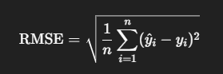
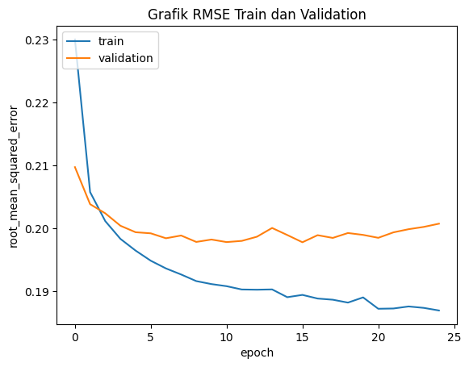

# Laporan Proyek Machine Learning - Al Jauzi Abdurrohman

## Project Overview

Di era digital saat ini, pengguna menghadapi tantangan dalam memilih konten yang sesuai dari sekian banyak pilihan yang tersedia. Salah satu solusi penting dalam mengatasi masalah ini adalah sistem rekomendasi. Sistem rekomendasi banyak digunakan dalam berbagai platform seperti e-commerce, layanan streaming, dan media sosial untuk memberikan rekomendasi yang relevan dan personal kepada pengguna.

Dalam proyek ini, digunakan MovieLens Small Dataset, yang merupakan dataset standar dalam penelitian sistem rekomendasi. Dataset ini berisi data mengenai pengguna, film, rating, serta genre dari film tersebut. Proyek ini bertujuan untuk membangun sistem rekomendasi film menggunakan model Collaborative Filtering (CF), yaitu dengan cara merekomendasikan film berdasarkan kesamaan pola rating antar pengguna.

## Business Understanding

Sistem rekomendasi dapat meningkatkan pengalaman pengguna dalam memilih film, membantu platform dalam mempertahankan pengguna, serta meningkatkan waktu tonton dan kepuasan. Oleh karena itu, membangun sistem rekomendasi yang akurat menjadi sangat penting bagi bisnis yang bergerak di bidang penyediaan konten hiburan digital.

### Problem Statements
1. Bagaimana cara merekomendasikan film kepada pengguna berdasarkan pola interaksi (rating) yang serupa dengan pengguna lain, tanpa menggunakan informasi konten film secara eksplisit?
2. Bagaimana memprediksi film yang kemungkinan akan disukai oleh pengguna menggunakan model Collaborative Filtering berbasis data rating historis?
3. Bagaimana performa pendekatan Collaborative Filtering dalam memberikan rekomendasi yang relevan?

### Goals
1. Membangun sistem rekomendasi menggunakan pendekatan model-based Collaborative Filtering dengan menerapkan teknik matrix factorization terhadap data interaksi pengguna.
2. Menghasilkan rekomendasi film yang relevan berdasarkan hasil prediksi rating terhadap film yang belum ditonton oleh pengguna.

### Solution statements
Untuk mencapai tujuan proyek, dilakukan pendekatan berikut:
- Menggunakan data ratings.csv yang memuat informasi userId, movieId, dan rating.
- Membangun user-item matrix dan menerapkan matrix factorization.
- Menyediakan rekomendasi berdasarkan prediksi rating tertinggi dari model terhadap item yang belum diberi rating oleh pengguna.

Dengan menggunakan pendekatan ini, proyek bertujuan memberikan wawasan yang lebih luas tentang metode CF dalam konteks sistem rekomendasi film.

## Data Understanding
Data yang digunakan adalah dataset rating terhadap film dari MovieLens Latest Dataset (recommended for education and development) (URL: https://grouplens.org/datasets/movielens/). Pada sel kode notebook, dataset ini dapat diunduh menggunakan kode berikut:
```sh
# Download file zip dari URL
!wget https://files.grouplens.org/datasets/movielens/ml-latest-small.zip
# Ekstrak isi file ZIP
!unzip -o ml-latest-small.zip
```
Dataset ini berisikan 4 file csv (3 csv merupakan variabel untuk film dan 1 csv merupakan data rating user terhadap film) dan 1 file README.txt yang berisi deskripsi dataset.

| Variabel | Jumlah Baris | Deskripsi |
| ------ | ------ | ------ |
| movies | 9742 | Metadata film, yaitu judul film dan genre film tersebut |
| links | 9742 | ID link film di imdb.com dan themoviedb.com |
| tags | 1589 | Tag pada film yang diberikan pengguna |

Untuk mengetahui variabel-variabel tersebut lebih mendalam, kita akan melakukan Exploratory Data Analysis dengan teknik Univariate Analysis.

### EDA - Univariate Analysis (movies)
Pertama, mari kita eksplorasi variabel movies, yaitu metadata film. Mari kita lihat kolom movies menggunakan fungsi info().
```sh
movies.info()
```
Output:
| # | Non-Null Count | Dtype |
| ------ | ------ | ------ |
| movieId | 9742 non-null | int64 |
| title | 9742 non-null | object |
| genres | 9742 non-null | object |

Berdasarkan output di atas, kita dapat mengetahui bahwa terdapat 9742 film yang ada pada dataset tersebut dan tidak ada missing value. Berikut adalah penjelasan dari kolom yang ada:
- `movieId` : identifier unik untuk setiap film
- `title` : judul film
- `genres` : genre film

Untuk melihat sampel datanya, mari kita terapkan fungsi head()
```sh
movies.head()
```
Output:
| movieId | title | genres |
| ------ | ------ | ------ |
| 1	| Toy Story (1995) | Adventure\|Animation\|Children\|Comedy\|Fantasy |
| 2 | Jumanji (1995) | Adventure\|Children\|Fantasy |
| 3	| Grumpier Old Men (1995)	| Comedy\|Romance |
| 4 | Waiting to Exhale (1995) | Comedy\|Drama\|Romance |
| 5 | Father of the Bride Part II (1995) | Comedy |

Berdasarkan output di atas, satu film bisa terdiri dari beberapa genre yang dipisahkan oleh tanda '|'. Untuk mengetahui ada genre apa saja pada data tersebut, terapkan kode berikut:
```sh
# Pecah genre berdasarkan '|', lalu flatten dan ambil yang unik
unique_genres = set()
for genre_list in movies['genres']:
    genres_split = genre_list.split('|')
    unique_genres.update(genres_split)
# Tampilkan hasil
print(sorted(unique_genres))
```
Output:
```sh
['(no genres listed)', 'Action', 'Adventure', 'Animation', 'Children', 'Comedy', 'Crime', 'Documentary', 'Drama', 'Fantasy', 'Film-Noir', 'Horror', 'IMAX', 'Musical', 'Mystery', 'Romance', 'Sci-Fi', 'Thriller', 'War', 'Western']
```

Terdapat 20 jenis genre berbeda dengan nama genre seperti terlihat pada output kode. Perhatikanlah jenis-jenis genre di atas. Pada tahap selanjutnya kita akan gunakan data genre ini untuk memprediksi top-N rekomendasi bagi pengguna.
Naumn, terdapat nilai kolom genre = (no genres listed), artinya ada film yang genrenya tidak diketahui. Maka dari itu, kita akan memeriksa terlebih dahulu ada berapa film dengan kondisi tersebut. Terapkan kode berikut.
```sh
# Filter film yang tidak memiliki genre (no genres listed)
no_genre_movies = movies[movies['genres'] == '(no genres listed)']
# Tampilkan jumlah baris
print(f"Jumlah film yang tidak memiliki genre (no genres listed): {len(no_genre_movies)}")
```
Output:
```
Jumlah film yang tidak memiliki genre (no genres listed): 34
```
Jumlah 34 film jika dibandingkan dengan jumlah keseluruhan, yaitu 9742 film terbilang tidak signifikan. Maka dari itu, pada proses Data Preprocessing, data tersebut akan dihilangkan. Selanjutnya, kita eksplorasi variabel links, yaitu link dari film yang ada.

### EDA - Univariate Analysis (links)
Kedua, mari kita eksplorasi variabel links, yaitu ID link film di imdb.com dan themoviedb.com. Mari kita lihat kolom yang terdapat pada links menggunakan fungsi info().
```sh
links.info()
```
Output:
| # | Non-Null Count | Dtype |
| ------ | ------ | ------ |
| movieId | 9742 non-null | int64 |
| imdbId | 9742 non-null | int64 |
| tmdbId | 9734 non-null | float64 |

Berikut adalah penjelasan dari kolom yang ada:
- `movieId` : merupakan nilai identifier pada URL: https://movielens.org/movies/{movieId}
- `imdbId` :  merupakan nilai identifier pada URL: http://www.imdb.com/title/{imdbId}
- `tmdbId` : merupakan nilai identifier pada URL: https://www.themoviedb.org/movie/{tmdbId}.

Pada kolom tmdbId, terdapat 8 baris yang kosong, namun karena kolom ini tidak diikutsertakan dalam proses perhitungan, maka dapat kita biarkan saja. Untuk melihat sampel datanya, mari kita terapkan fungsi head().
```sh
links.head()
```
Output:
| movieId | imdbId | tmdbId |
| ------ | ------ | ------ |
| 1 | 114709 | 862.0 |
| 2 | 113497 | 8844.0 |
| 3 | 113228 | 15602.0 |
| 4 | 114885 | 31357.0 |
| 5	| 113041 | 11862.0 |

Berdasarkan output baris pertama, movieId = 1 memiliki link movielens https://movielens.org/movies/1, link imdb http://www.imdb.com/title/114709, dan link tmdb https://www.themoviedb.org/movie/862. Demikian seterusnya.

### EDA - Univariate Analysis (tags)
Selanjutnya, kita eksplorasi variabel tags, yaitu tag pada film yang diberikan pengguna. Mari kita lihat kolom yang terdapat pada tags menggunakan fungsi info().
```sh
tags.info()
```
Output:
| # | Non-Null Count | Dtype |
| ------ | ------ | ------ |
| userId | 3683 non-null | int64 |
| movieId | 3683 non-null | int64 |
| tag | 3683 non-null | object |
| timestamp | 3683 non-null | int64 |

Berikut adalah penjelasan dari kolom yang ada:
- `userId` : merupakan user yang memberikan tag pada film
- `movieId` :  merupakan film yang diberi tag oleh user
- `tag` : merupakan tag yang diberikan oleh user
- `timestamp` : merupakan waktu ketika pengguna memberikan tag terhadap sebuah film. Nilainya berupa angka dalam format UNIX timestamp, yaitu jumlah detik sejak 1 Januari 1970 (epoch time)

Untuk melihat sampel datanya, mari kita terapkan fungsi head()
```sh
tags.head()
```
Output:
| userId | movieId | tag | timestamp |
| ------ | ------ | ------ | ------ |
| 2 | 60756 | funny | 1445714994 |
| 2 | 60756 | Highly quotable | 1445714996 |
| 2 | 60756 | will ferrell | 1445714992 |
| 2 | 89774 |Boxing story | 1445715207 |
| 2	| 89774 | MMA | 1445715200 |

Baris ke-1 dari output di atas memberikan arti bahwa user dengan userId = 2 memberikan tag 'funny' ke film dengan movieId = 60756 pada 24 Oktober 2015 pukul 14:49:54 UTC (setelah dikonversi dari UNIX timestamp). Demikian seterusnya.

### EDA - Univariate Analysis (user)
Selanjutnya, kita eksplorasi variabel user. Namun, pada dataset ini user tidak memiliki file .csv nya sendiri. Pada ratings.csv, terdapat kolom userId, kolom ini akan kita gunakan untuk mengidentifikasi jumlah user yang telah memberikan rating terhadap film. Terapkan kode berikut.
```sh
print('Jumlah user yang memberikan rating: ', len(ratings.userId.unique()))
```
Output:
```sh
Jumlah user yang memberikan rating:  610
```
Berdasarkan output di atas, diketahui terdapat 610 user yang telah memberikan rating terhadap film. Data ini akan digunakan untuk tahap modelling dengan Collaborative Filtering.
Pada tahap modelling dengan Content-Based Filtering nanti, data yang dibutuhkan adalah judul film dan genre. Kita akan menghitung kesamaan (similarity) genre dan judul film kemudian membuat rekomendasi berdasarkan kesamaan ini.

### EDA - Univariate Analysis (ratings)
Selanjutnya, mari kita eksplorasi data yang akan kita gunakan pada model yaitu data ratings. Pertama, kita lihat seperti apa data pada variabel rating dengan fungsi head().
```sh
ratings.head()
```
Output:
| userId | movieId | rating | timestamp |
| ------ | ------ | ------ | ------ |
| 1 | 1	| 4.0 |	964982703 |
| 1	| 3	| 4.0	| 964981247 |
| 1	| 6	| 4.0 |	964982224 |
| 1	| 47 | 5.0 | 964983815 |
| 1	| 50 | 5.0 | 964982931 |

Dari fungsi rating.head(), kita dapat mengetahui bahwa data rating terdiri dari 4 kolom. Kolom-kolom tersebut antara lain:

- `userId` : merupakan ID user
- `movieId` : merupakan ID film
- `rating` : merupakan data rating yang diberikan user terhadap film
- `timestamp` : merupakan waktu ketika pengguna memberikan rating terhadap sebuah film. Nilainya berupa angka dalam format UNIX timestamp, yaitu jumlah detik sejak 1 Januari 1970 (epoch time)

Untuk melihat distribusi rating pada data, gunakan fungsi describe() dengan menerapkan kode berikut:
```sh
ratings.describe()
```
Output:
| | userId | movieId | rating | timestamp |
| ------ | ------ | ------ | ------ | ------ |
| count	| 100836.000000 | 100836.000000 | 100836.000000 | 1.008360e+05 |
| mean | 326.127564 | 19435.295718 | 3.501557 |	1.205946e+09 |
| std |	182.618491 | 35530.987199 |	1.042529 | 2.162610e+08 |
| min | 1.000000 | 1.000000 | 0.500000 | 8.281246e+08 |
| 25% | 177.000000 | 1199.000000 | 3.000000 | 1.019124e+09 |
| 50% | 325.000000 | 2991.000000 | 3.500000 | 1.186087e+09 |
| 75% | 477.000000 | 8122.000000 | 4.000000 | 1.435994e+09 |
| max | 610.000000 | 193609.000000 | 5.000000 |	1.537799e+09 |

Dari output di atas, diketahui bahwa terdapat 100836 total rating dan nilai maksimum rating adalah 5 dan nilai minimumnya adalah 0.5. Artinya, skala rating berkisar antara 0.5 hingga 5. 
Sampai di tahap ini, kita telah memahami variabel-variabel pada data yang kita miliki.

### Data Preprocessing - Memeriksa Missing Value pada Rating
Untuk memeriksa apakah terdapat missing value, jalankan kode berikut.
```sh
ratings.isnull().sum()
```
Output:
| | 0 |
| ------ | ------ |
| userId | 0 |
| movieId |	0 |
| rating | 0 |
| timestamp | 0 |
| title	| 0 |
| genres | 0 |

Tidak ada missing value yang ditemukan, kita dapat lanjut ke tahap berikutnya.

### Data Preprocessing - Menggabungkan Data Rating dengan Fitur Genre Film
Langkah selanjutnya adalah menggabungkan variabel ratings dengan variabel movies, yaitu metadata film yang mengandung judul film dan genrenya. Implementasikan kode berikut.
```sh
movies_ratings = pd.merge(ratings, movies, on='movieId', how='left')
movies_ratings
```
Output:
| userId | movieId | rating | timestamp | title | genres |
| ------ | ------ | ------ | ------ | ------ | ------ |
| 1 | 1	| 4.0 |	964982703 |	Toy Story (1995) | Adventure\|Animation\|Children\|Comedy\|Fantasy |
| 1	| 3	| 4.0 |	964981247 |	Grumpier Old Men (1995) | Comedy\|Romance |
| 1	| 6	| 4.0 |	964982224 |	Heat (1995)	| Action\|Crime\|Thriller |
| 1	| 47 | 5.0 | 964983815 | Seven (a.k.a. Se7en) (1995) | Mystery\|Thriller |
| 1	| 50 | 5.0 | 964982931 | Usual Suspects, The (1995) | Crime\|Mystery\|Thriller |
| ... | ... | ... | ... | ... | ... |

Inilah data yang akan kita gunakan untuk membuat sistem rekomendasi. Namun, sebagai trivia, kita akan mencari tahu film apa yang memiliki rating tertinggi, jalankan kode berikut:
```sh
movies_ratings[['movieId', 'title', 'rating']].groupby(['movieId', 'title']).sum().reset_index().sort_values(by='rating', ascending=False)
```
Output:
|  | movieId | title | rating |
| ------ | ------ | ------ | ------ |
| 277 |	318	| Shawshank Redemption, The (1994) | 1404.0 |
| 314 |	356	| Forrest Gump (1994) | 1370.0 |
| 257 |	296	| Pulp Fiction (1994) | 1288.5 |
| 1938 | 2571 | Matrix, The (1999) | 1165.5 |
| 510 |	593	| Silence of the Lambs, The (1991) | 1161.0 |
| ... |	... | ... |	... |

Film yang paling banyak mendapatkan rating adalah film The Shawshank Redemption (1994) dengan jumlah rating 1404. Sebaliknya, film yang paling sedikit mendapatkan jumlah rating adalah fillm Lionheart (1990) dengan jumlah rating 0.5.

Berikutnya, mari kita menuju tahapan Data Preparation.

## Data Preparation

### Mengatasi Missing Value
Pada tahap EDA - Univariate Analysis (movies), kita mendapat informasi 'Jumlah film yang tidak memiliki genre (no genres listed): 34'. Informasi tersebut akan kita tangani dalam tahap ini, yaitu dengan cara menghapus baris yang memiliki genre '(no genres listed)'. Terapkan kode berikut.
```sh
movies_ratings = movies_ratings[movies_ratings['genres'] != '(no genres listed)']
```
Setelah menjalankan kode tersebut, data movies_ratings yang sebelumnya memiliki 100836 baris, sekarang menjadi 100789 baris. Mari kita cek kembali datanya apakah ada missing value atau tidak. Jalankan kode berikut.
```sh
movies_ratings.isnull().sum()
```
Output:
|  | 0 |
| ------ | ------ |
| userId | 0 |
| movieId |	0 |
| rating | 0 |
| timestamp | 0 |
| title | 0 |
| genres | 0 |

Ok, sekarang data kita sudah bersih. Mari lanjutkan ke tahap berikutnya.

### Mempersiapkan Data Rating
Dalam sistem rekomendasi berbasis Collaborative Filtering, penting untuk memastikan satu film memiliki satu baris nilai genre (bisa terdiri dari satu genre atau beberapa genre yang dipisahkan oleh tanda '|'). Tujuannya agar sistem dapat merekomendasikan film yang mirip dengan yang disukai user sebelumnya dan tidak terjadi dobel atau rangkap kategori dalam satu film. Dalam model CF, kita hanya butuh 1 baris per film untuk mengambil fitur filmnya — tidak perlu semua rating dari user. Maka dari itu, kita perlu menghapus nilai kolom movieId yang duplikat dari dataframe movie_ratings.

Berikutnya, kita bisa melanjutkan ke tahap persiapan. Buatlah variabel bernama preparation untuk persiapan yang mengambil data movies_ratings dari tahap sebelumnya.
```sh
preparation = movies_ratings
```
Selanjutnya, kita hanya akan menggunakan data unik untuk dimasukkan ke dalam proses pemodelan. Oleh karena itu, kita perlu menghapus data yang duplikat dengan fungsi drop_duplicates(). Dalam hal ini, kita membuang data duplikat pada kolom ‘movieId’. Implementasikan kode berikut.
```sh
preparation = preparation.drop_duplicates('movieId')
```
Setelah menjalankan kode tersebut, data preparation yang sebelumnya memiliki 100789 baris, sekarang menjadi 9690 baris. Selanjutnya, kita perlu melakukan konversi data series menjadi list. Dalam hal ini, kita menggunakan fungsi tolist() dari library numpy. Implementasikan kode berikut.
```sh
movie_id = preparation['movieId'].tolist()
movie_title = preparation['title'].tolist()
movie_genres = preparation['genres'].tolist()
```
Tahap berikutnya, kita akan membuat dictionary untuk menentukan pasangan key-value pada data movie_id, movie_title, dan movie_genres yang telah kita siapkan sebelumnya.
```sh
movie_new = pd.DataFrame({
    'id': movie_id,
    'movie_title': movie_title,
    'movie_genres': movie_genres
})
movie_new
```
Output:
| id | movie_title | movie_genres |
| ------ | ------ | ------ |
| 1	| Toy Story (1995) | Adventure\|Animation\|Children\|Comedy\|Fantasy |
| 3	| Grumpier Old Men (1995) |	Comedy\|Romance |
| 6	| Heat (1995) | Action\|Crime\|Thriller |
| 47 | Seven (a.k.a. Se7en) (1995) | Mystery\|Thriller |
| 50 | Usual Suspects, The (1995) |	Crime\|Mystery\|Thriller |

Pahami terlebih dahulu data rating yang kita miliki. Ingatlah saat kita melakukan load data di awal dan membaca file rating_final.csv. Saat itu, kita membuat variabel rating dan menetapkan data pada variabel tersebut. Kemudian, kita menghapus rating pada data film dengan genres = '(no_genres_listed)' dan menyimpannya dalam variabel movies_ratings. Untuk memudahkan supaya tidak tertukar dengan fitur ‘rating’ pada data, kita ubah nama variabel movies_ratings (tanpa kolom genres dan title) menjadi variabel df.
```sh
df = movies_ratings.drop(['genres', 'title'], axis=1)
```

### Encoding userId dan movieId
Sekarang data rating memiliki 100789 baris dan 4 kolom. Sekarang kita memasuki tahap encoding userId dan movieId. Pada tahap ini, kita perlu melakukan persiapan data untuk menyandikan (encode) fitur ‘userId’ dan ‘movieId’ ke dalam indeks integer. Terapkan kode berikut.
```sh
user_ids = df['userId'].unique().tolist()
user_to_user_encoded = {x: i for i, x in enumerate(user_ids)}
user_encoded_to_user = {i: x for i, x in enumerate(user_ids)}
```
Selanjutnya, lakukan hal yang sama pada fitur ‘movieId’.
```sh
movie_ids = df['movieId'].unique().tolist()
movie_to_movie_encoded = {x: i for i, x in enumerate(movie_ids)}
movie_encoded_to_movie = {i: x for i, x in enumerate(movie_ids)}
```
Berikutnya, petakan userId dan movieId ke dataframe yang berkaitan.
```sh
df['user'] = df['userId'].map(user_to_user_encoded)
df['movie'] = df['movieId'].map(movie_to_movie_encoded)
```
Tahap persiapan telah selesai. Berikut adalah hal-hal yang telah kita lakukan pada tahap ini:
- Memahami data rating yang kita miliki.
- Menyandikan (encode) fitur ‘userId’ dan ‘movieId’ ke dalam indeks integer.
- Memetakan ‘userID’ dan ‘movieId’ ke dataframe yang berkaitan.
- Mengecek beberapa hal dalam data seperti jumlah user, jumlah film, kemudian mengubah nilai rating menjadi float.

Tahap persiapan ini penting dilakukan agar data siap digunakan untuk
pemodelan. Namun sebelumnya, kita perlu membagi data untuk training dan validasi terlebih dahulu.

### Train & Validation Split
Sebelum membagi data menjadi data training dan validasi, datanya perlu diacak terlebih dahulu agar distribusinya menjadi acak dan tidak terurut, sehingga tidak terjadi bias selama pelatihan model.
```sh
df = df.sample(frac=1, random_state=42)
```
- frac=1 berarti "fraction" = 100% dari data diambil, tapi urutannya diacak.
- random_state=42 berarti menetapkan seed untuk pengacakan, agar hasil acakan selalu sama setiap kali dijalankan. Angka 42 bisa diganti berapa pun, tapi disarankan untuk tetap konsisten agar replikasi bisa dilakukan.

Selanjutnya, kita bagi data train dan validasi dengan komposisi 80:20. Namun sebelumnya, kita perlu memetakan (mapping) data user dan film menjadi satu value terlebih dahulu. Lalu, buatlah rating dalam skala 0 sampai 1 agar mudah dalam melakukan proses training.
```sh
x = df[['user', 'movie']].values
y = df['rating'].apply(lambda x: (x - min_rating) / (max_rating - min_rating)).values
train_indices = int(0.8 * df.shape[0])
x_train, x_val, y_train, y_val = (x[:train_indices], x[train_indices:], y[:train_indices], y[train_indices:])
print(x, y)
```
Output:
```sh
[[   6  783]
 [ 413 5917]
 [ 508  875]
 ...
 [ 479 5869]
 [   5  712]
 [ 102 1129]] [0.66666667 0.66666667 0.66666667 ... 0.11111111 0.55555556 0.88888889]
 ```
 Kode tersebut digunakan untuk mempersiapkan data sebelum dimasukkan ke dalam model dengan cara memisahkan fitur dan label, melakukan normalisasi rating, serta membagi data menjadi data latih dan validasi. Pertama, `x = df[['user', 'movie']].values` mengambil kolom hasil encoding user dan movie sebagai fitur input dan mengubahnya menjadi array NumPy. Kemudian, `y = df['rating'].apply(lambda x: (x - min_rating) / (max_rating - min_rating)).values` menormalisasi nilai rating agar berada dalam rentang 0 hingga 1, yang mempermudah proses pelatihan model. Selanjutnya, `train_indices = int(0.8 * df.shape[0])` menghitung jumlah baris yang digunakan untuk data latih berdasarkan 80% dari total data. Terakhir, data dibagi menjadi `x_train, x_val, y_train, dan y_val` menggunakan slicing berdasarkan indeks tersebut, dan `print(x, y)` digunakan untuk menampilkan isi array input dan label yang telah diproses.
 Data telah siap untuk dimasukkan ke dalam model untuk dievaluasi.

## Modelling
Pada Collaborative Filtering, pendekatan yang digunakan berfokus pada pola interaksi antara pengguna dan film. Kita perlu melakukan encoding data pengguna dan film, membagi data menjadi training dan testing, lalu melatih model menggunakan data tersebut. Setelah pelatihan selesai, model akan dievaluasi untuk mengetahui seberapa baik kemampuannya dalam memahami preferensi pengguna dan memberikan rekomendasi film yang relevan.

Collaborative Filtering mampu menemukan pola yang lebih kompleks dari pada model Content Based Filtering dalam perilaku pengguna dan dapat merekomendasikan item di luar preferensi konten sebelumnya. Namun, model ini memerlukan data interaksi yang cukup besar agar akurat, dan dapat mengalami masalah cold start ketika menghadapi pengguna atau item baru yang belum memiliki cukup data.

Pada tahap ini, model menghitung skor kecocokan antara user dan film dengan teknik embedding. Pertama, kita melakukan proses embedding terhadap data user dan film. Selanjutnya, lakukan operasi perkalian dot product antara embedding user dan film. Selain itu, kita juga dapat menambahkan bias untuk setiap user dan film. Skor kecocokan ditetapkan dalam skala [0,1] dengan fungsi aktivasi sigmoid.

Di sini, kita membuat class RecommenderNet dengan keras Model class. Kode class RecommenderNet ini terinspirasi dari tutorial dalam situs Keras dengan beberapa adaptasi sesuai kasus yang sedang kita selesaikan. Pada tahap ini, model menghitung skor kecocokan antara user dan film menggunakan teknik embedding, yang memungkinkan model merepresentasikan user dan film dalam bentuk vektor berdimensi rendah. Proses ini dilakukan oleh kelas RecommenderNet, yang merupakan turunan dari tf.keras.Model. Berikut penjelasan dari tahapannya:
1. Embedding Layer
Model membuat dua embedding layer terpisah untuk:
    - User (self.user_embedding)
    Menerjemahkan ID user menjadi vektor berdimensi embedding_size.
    - Film (self.movie_embedding)
    Menerjemahkan ID film menjadi vektor berdimensi embedding_size.

    Selain itu, model juga membuat bias embedding untuk masing-masing:
    - self.user_bias: memberikan nilai bias untuk tiap user.
    - self.movie_bias: memberikan nilai bias untuk tiap film.

2. Dot Product (Perkalian Vektor)
Pada fungsi call(), model menerima input berisi pasangan [user_id, movie_id].
Kemudian, dilakukan:
- Pengambilan embedding user dan film berdasarkan ID masing-masing.
- Pengambilan bias user dan bias film.
- Penghitungan dot product antara embedding user dan embedding film, yaitu tf.tensordot(user_vector, movie_vector, 2), yang menghasilkan skor kecocokan mentah.

3. Penambahan Bias
Hasil dot product tersebut ditambahkan dengan user_bias dan movie_bias untuk mengakomodasi preferensi atau kecenderungan masing-masing user dan film yang tidak ditangkap oleh embedding saja.

4. Aktivasi Sigmoid
Nilai akhir (skor kecocokan) dilewatkan ke fungsi aktivasi sigmoid, yang akan memetakan skor tersebut ke dalam rentang [0, 1].
Nilai ini dapat diinterpretasikan sebagai probabilitas seberapa besar kemungkinan user akan menyukai film tersebut.

Selanjutnya, lakukan proses compile terhadap model.
```sh
model = RecommenderNet(num_users, num_movie, 50)
model.compile(loss = tf.keras.losses.BinaryCrossentropy(), optimizer = keras.optimizers.Adam(learning_rate=0.001), metrics=[tf.keras.metrics.RootMeanSquaredError()])
```
Model ini merupakan model rekomendasi sederhana yang dibangun dengan arsitektur RecommenderNet. Model ini dirancang untuk memprediksi tingkat kecocokan antara pengguna dan film berdasarkan embedding. Jumlah pengguna (num_users) dan film (num_movie) ditentukan berdasarkan dataset, dan 50 merupakan ukuran dari embedding vector yang digunakan untuk mewakili setiap pengguna dan film dalam ruang fitur laten.
Selanjutnya, model di-compile dengan beberapa parameter, yaitu:
- Loss function BinaryCrossentropy: Digunakan untuk mengukur seberapa jauh prediksi model dari nilai target sebenarnya, dalam konteks klasifikasi biner (antara user dan film).
- Optimizer Adam dengan LR = 0.001: Digunakan untuk mengupdate bobot model selama training untuk meminimalkan loss. Nilai 0.001 merupakan nilai standar yang memberikan laju pembelajaran yang stabil, tidak terlalu cepat sehingga menghindari overshooting, dan tidak terlalu lambat agar proses training efisien. Adam adalah salah satu optimizer yang paling umum karena menggabungkan kelebihan dari dua metode lainnya: AdaGrad dan RMSProp. Adam dapat menangani data yang sparse dan memiliki performa konvergensi yang baik dengan sedikit penyesuaian hyperparameter.
- Metrik evaluasi RMSE: Digunakan untuk mengevaluasi performa model selama training dan testing dengan menghitung akar dari rata-rata kuadrat selisih antara prediksi dan nilai aktual. Semakin kecil nilai RMSE, maka semakin akurat model dalam memprediksi.

RMSE dirumuskan sebagai berikut:



Di mana:
- 𝑛: jumlah data (jumlah pasangan prediksi-aktual)
- ŷ𝑖: nilai yang diprediksi oleh model pada data ke-i
- 𝑦𝑖: nilai aktual (ground truth) pada data ke-i
- (ŷ𝑖 - 𝑦𝑖)^2 : kuadrat dari selisih antara prediksi dan aktual

RMSE adalah akar dari rata-rata kuadrat selisih antara prediksi dan nilai aktual. Cocok digunakan untuk mengukur performa sistem rekomendasi yang memprediksi angka seperti rating. Nilai RMSE yang rendah menunjukkan model yang akurat.

## Evaluation
Selanjutnya, kita akan melatih model dengan data training dan data validation yang telah ditetapkan sebelumnya dengan 25 epoch dan nilai batch size = 32. Penggunaan batch_size = 32 berarti model akan memproses 32 data sekaligus sebelum memperbarui bobotnya. Ukuran ini memberikan keseimbangan antara kecepatan training, efisiensi memori, dan akurasi pembelajaran, serta merupakan salah satu pilihan batch size yang paling umum digunakan dalam praktik deep learning. Penggunaan epoch = 25 berarti model akan dilatih selama 25 putaran penuh. Jumlah ini cukup untuk memberikan model waktu belajar yang memadai tanpa terlalu lama sehingga berisiko overfitting. Training model CF dapat dilakukan dengan kode berikut:
```sh
history = model.fit(x = x_train, y = y_train, batch_size = 32, epochs = 25, validation_data = (x_val, y_val))
```
Berikut adalah visualisasi grafik RMSE selama proses training dan validation:


Sumbu x menunjukkan epoch dan sumbu y menunjukkan nilai RMSE. Perhatikanlah, proses training dan validation model cukup smooth dan model konvergen pada epochs sekitar 25. Dari proses ini, kita memperoleh nilai error akhir sebesar 0.1875 dan error pada data validasi sebesar 0.2007. Nilai tersebut cukup bagus untuk sistem rekomendasi. Mari kita cek, apakah model ini bisa membuat rekomendasi dengan baik?


### Mendapatkan Rekomendasi Film
Untuk mendapatkan rekomendasi film, pertama kita ambil sampel user secara acak dan definisikan variabel movie_not_watched yang merupakan daftar film yang belum pernah ditonton oleh user. Daftar movie_not_watched inilah yang akan menjadi film yang kita rekomendasikan.

Sebelumnya, user telah memberi rating pada beberapa film yang telah mereka tonton. Kita menggunakan rating ini untuk membuat rekomendasi film yang mungkin cocok untuk user. Nah, film yang akan direkomendasikan tentulah film yang belum pernah ditonton oleh user. Oleh karena itu, kita perlu membuat variabel movie_not_watched sebagai daftar film untuk direkomendasikan pada user. Variabel movie_not_watched diperoleh dengan menggunakan operator bitwise (~) pada variabel movie_watched_by_user.
Terapkan kode berikut.
```sh
movie_df = movie_new
df = movies_ratings.drop(['genres', 'title'], axis=1)
user_id = df.userId.sample(1).iloc[0]
movie_watched_by_user = df[df.userId == user_id]
# Operator bitwise (~), bisa diketahui di sini https://docs.python.org/3/reference/expressions.html
movie_not_watched = movie_df[~movie_df['id'].isin(movie_watched_by_user.movieId.values)]['id']
movie_not_watched = list(
    set(movie_not_watched)
    .intersection(set(movie_to_movie_encoded.keys()))
)
movie_not_watched = [[movie_to_movie_encoded.get(x)] for x in movie_not_watched]
user_encoder = user_to_user_encoded.get(user_id)
user_movie_array = np.hstack(
    ([[user_encoder]] * len(movie_not_watched), movie_not_watched)
)
```
Kode tersebut bertujuan untuk menyiapkan data rekomendasi film bagi seorang pengguna secara acak. Pertama, dipilih satu userId secara acak dari dataset, lalu diambil daftar film yang sudah ditonton oleh user tersebut. Selanjutnya, digunakan operator bitwise NOT (~) untuk mendapatkan daftar film yang belum ditonton oleh user dengan membandingkan semua film yang ada di dataset. Daftar film ini kemudian disaring agar hanya mencakup film yang telah diencoding (ada di movie_to_movie_encoded), lalu setiap ID film dikonversi ke bentuk numerik. Setelah itu, ID user juga dikonversi ke bentuk numerik, dan dibentuk array pasangan user-film dalam bentuk numerik, yang siap digunakan sebagai input bagi model rekomendasi untuk memprediksi skor kecocokan antara user dan film.

Selanjutnya, untuk memperoleh rekomendasi film, gunakan fungsi model.predict() dari library Keras dengan menerapkan kode berikut.
```sh
ratings = model.predict(user_movie_array).flatten()
top_ratings_indices = ratings.argsort()[-10:][::-1]
recommended_movie_ids = [
    movie_encoded_to_movie.get(movie_not_watched[x][0]) for x in top_ratings_indices
]
print('Showing recommendations for users: {}'.format(user_id))
print('===' * 9)
print('Movies with high ratings from user')
print('----' * 8)
top_movie_user = (
    movie_watched_by_user.sort_values(
        by = 'rating',
        ascending=False
    )
    .head(5)
    .movieId.values
)
movie_df_rows = movie_df[movie_df['id'].isin(top_movie_user)]
for row in movie_df_rows.itertuples():
    print(row.movie_title, ':', row.movie_genres)
print('----' * 8)
print('Top 10 Movies Recommendation')
print('----' * 8)
recommended_movie = movie_df[movie_df['id'].isin(recommended_movie_ids)]
for row in recommended_movie.itertuples():
    print(row.movie_title, ':', row.movie_genres)
```
Output:
```sh
298/298 ━━━━━━━━━━━━━━━━━━━━ 1s 2ms/step
Showing recommendations for users: 279
===========================
Movies with high ratings from user
--------------------------------
Star Wars: Episode IV - A New Hope (1977) : Action|Adventure|Sci-Fi
Pulp Fiction (1994) : Comedy|Crime|Drama|Thriller
Alien (1979) : Horror|Sci-Fi
Thing, The (1982) : Action|Horror|Sci-Fi|Thriller
Blade Runner (1982) : Action|Sci-Fi|Thriller
--------------------------------
Top 10 Movies Recommendation
--------------------------------
Inside Job (2010) : Documentary
Ran (1985) : Drama|War
Gallipoli (1981) : Drama|War
Lawrence of Arabia (1962) : Adventure|Drama|War
Streetcar Named Desire, A (1951) : Drama
Band of Brothers (2001) : Action|Drama|War
Trial, The (Procès, Le) (1962) : Drama
Captain Fantastic (2016) : Drama
Paths of Glory (1957) : Drama|War
Yi Yi (2000) : Drama
```
Kita telah berhasil memberikan rekomendasi kepada user, dan sebagai contoh, hasil di atas adalah rekomendasi untuk user dengan userId 279. Dari output tersebut, kita dapat melihat dua bagian utama: "Movies with high ratings from user", yang menunjukkan daftar film yang sebelumnya diberi rating tinggi oleh user tersebut, dan "Top 10 Movies Recommendation", yang merupakan hasil rekomendasi berdasarkan preferensi user. Menariknya, banyak film yang direkomendasikan memiliki genre yang konsisten dengan preferensi genre user, seperti Drama, War, dan Documentary yang mendominasi daftar rekomendasi. Hal ini menunjukkan bahwa sistem rekomendasi berhasil mengenali pola preferensi pengguna dan memberikan saran yang relevan.

Sampai tahap ini, kita telah berhasil membangun sistem rekomendasi menggunakan teknik Collaborative Filtering, yang mengandalkan data interaksi pengguna (seperti rating) tanpa memerlukan informasi konten film secara langsung.

Untuk menjawab Problem Statements dan Goals pada proses Business Understanding, kita akan mengevaluasi masalah tersebut secara bertahap.
### Problem Statements - Jawaban
1. Bagaimana cara merekomendasikan film kepada pengguna berdasarkan pola interaksi (rating) yang serupa dengan pengguna lain, tanpa menggunakan informasi konten film secara eksplisit?
- Jawaban: Dengan menggunakan teknik Collaborative Filtering berbasis matrix factorization, sistem dapat mempelajari pola rating dari seluruh pengguna untuk menemukan keterkaitan laten antara pengguna dan film. Hal ini memungkinkan sistem merekomendasikan film yang relevan tanpa perlu mengetahui isi atau genre film secara eksplisit.
2. Bagaimana cara memberikan rekomendasi personal kepada pengguna berdasarkan pola rating pengguna lain yang memiliki selera serupa?
- Jawaban: Sistem memetakan pengguna dan film ke dalam vektor laten di ruang fitur yang sama, sehingga dapat mengukur kesamaan preferensi antar pengguna. Berdasarkan kesamaan ini, sistem memprediksi film mana yang kemungkinan besar akan disukai oleh pengguna, meskipun pengguna belum pernah menontonnya sebelumnya.
3. Bagaimana performa pendekatan Collaborative Filtering dalam memberikan rekomendasi yang relevan?
- Jawaban: Performa pendekatan diukur menggunakan evaluasi metrik kinerja, yaitu Root Mean Squared Error (RMSE). Dalam percobaan ini, model Collaborative Filtering mencapai nilai RMSE training sebesar 0.1875 dan RMSE validation sebesar 0.2007, yang menunjukkan model ini mampu memberikan prediksi rating yang cukup akurat.

### Goals - Jawaban
1. Membangun sistem rekomendasi menggunakan pendekatan model-based Collaborative Filtering dengan menerapkan teknik matrix factorization terhadap data interaksi pengguna.
- Jawaban: Sistem telah berhasil dibangun menggunakan pendekatan matrix factorization dengan library TensorFlow, di mana data interaksi pengguna digunakan untuk melatih model rekomendasi secara efisien dan akurat, tanpa memerlukan informasi konten film.
2. Menghasilkan rekomendasi film yang relevan berdasarkan hasil prediksi rating terhadap film yang belum ditonton oleh pengguna.
- Jawaban: Model yang telah dilatih mampu memprediksi rating film yang belum pernah ditonton oleh pengguna, dan dari prediksi tersebut sistem berhasil menghasilkan daftar rekomendasi yang sesuai dengan preferensi masing-masing pengguna, seperti ditunjukkan pada contoh output untuk userId 279.

**---Ini adalah bagian akhir laporan---**
